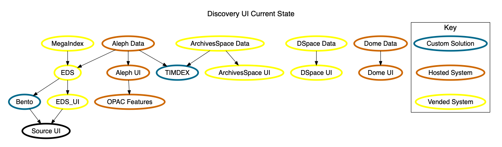
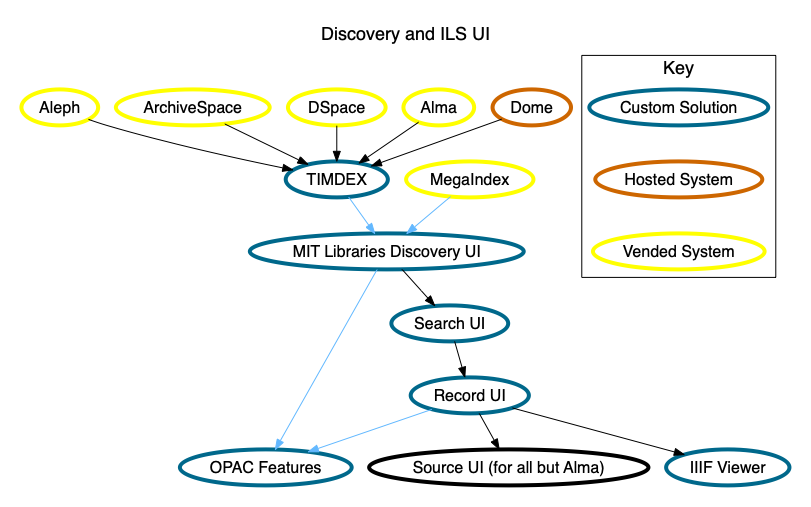

# Discovery Options

## Current State

Our current state is that we have a vended discovery tool, EDS, that we expose via both it's own UI as well as via a local integration with our Bento discovery tool. The Aleph data is loaded into EDS and TIMDEX, but at this time TIMDEX is not using that data to power any user interface.

There are systems of record that are not reflected in EDS (or Bento) at this time and remain silos of information, such as ArchivesSpace, DSpace and Dome. Some of the data from those systems is duplicated in Aleph and thus reflected in EDS / Bento but this is not comprehensive nor necessarily a sustainable solution.

## Vendor Centered

In this option, we move to Primo for our Alma Discovery and OPAC solution, and have a few options for how we handle our other discovery needs for systems such as ArchivesSpace, DSpace and Dome.

### Primo Everything

There is no technical reason we can't just load everything into Primo as it can handle more than just MARC. The benefit of this approach would be we could have all of our material discoverable in a single user interface.

However, we'd likely want a way to both have them all together yet allow users to be steered to appropriate sets of data to ensure that the more sparse records don't get lost in the sea of mega index results. Faceted options in Primo and some creative UI enhancements might approach a useful solution.

The main drawbacks around this solution come from a more Future of Libraries perspective. The goal is for the Libraries to provide open access to our data for use by both humans and programs. The Primo API is only available to programs the Libraries develop or sponsor. There is no notion of giving free access to all of Primo API to all users in the world. However, TIMDEX has this built in at it's core. We could _also_ load data into TIMDEX for the world to use, but it's unlikely we'd spend the time to make TIMDEX the best it could be if we don't consume it for any internal purposes as we would unlikely feel the pain of the limitations and thus not prioritize fixing them. As such, we should be aiming to use TIMDEX for as much internal discovery as we can to best understand it's limitations and set ourselves up to fix them.

### Primo for Alma, PrimoCentral for megaindex, TIMDEX for everything else

This solution would likely provide a Bento in front of Primo and TIMDEX to provide a starting point for discovery and hand users off to Primo and other local systems for further refining of searches or accessing content.

**This solution has the least risk to achieve the July 2021 target date without signficant resources becoming available to build a solution.**

This could mirror our existing EDS / Bento relationship (both the pros and the cons) and differ primarily in that the Aleph OPAC would be replaced with Primo.

The primary work in this scenario would be around any UI changes we want in Primo and updating Bento to consume Primo instead of EDS.

## TIMDEX Centered

Any TIMDEX centered solution shares the same benefit of giving us a project that consumes a core component of our services to provide both our UI as well as programmable access via direct API access.

These all also share the same risk of requiring significant engineering and UX staff time and are likely to put the July 2021 timeline at risk without additional resources we can't guarantee will be available to us.

It is possible that even if this is a desirable end state that it may make sense to choose Primo for the initial Alma migration so we can mitigate the risks of the custom solution.

### BlackLight Adapter

We could create an adapter to have BlackLight consume TIMDEX directly instead of using Solr. Any option we discuss around BlackLight should assume this as a requirement as we don't have any good reason to mirror our ElasticSearch data in Solr.

The main benefit of using BlackLight in this scenario would be if we like the BlackLight UI enough that we wouldn't want to change it. If we would want to make significant changes to the UI for local needs, it doesn't make a lot of sense to hack the UI and hack the data connectors as there isn't much left and we'd inherit nothing but technical debt.

Some negatives of this approach are that much of the BlackLight code base is tied to Solr syntax. This is a historical problem with the project that several people have tried to remove over the years and nobody has succeeded in doing in a way the community approved of. BlackLight is primarily a tool to put a UI on top of Solr. We wouldn't be doing that. We'd inherit all of the technical debt around that Solr decision and hope that the community doesn't make changes to the abstractions in a way that break our integration.

### BentoNext

Bento was originally conceived as being built out over time to take on more Discovery features such as paginated results and faceting. We pivoted away from that work to focus on products like TIMDEX, but now we are returning to the question of what our discovery UI should be. Bento is an interesting option in that it would allow us to focus on the features we need without being tied to community solutions that are sort of close to what we want but not quite.

Much of Bento is abstracted in a way that moving away from EDS would not be the significant work.

The work in this case would be adding the faceting and paginated results for TIMDEX (and a mega index if we choose to integrate that as well).

We'd also need to develop the OPAC features using the Alma API but those are well documented and limited in scope.

### Modern Web App

This may at first seem like an overambitious option... what if we started over with a local discovery UI from scratch?

Pros: we could build a modern web application using tooling that is designed to consume various APIs into single applications.

Cons: we don't have a lot of in house experience (yet) on this approach.

Longterm, this seems like possibly our best approach as it would leave us with an application that we could change vended systems or data sources and just adjust the application to feel the same to the user while entirely swapping out to whatever we need on the backend.

This is also the most work as it starts us over from scratch. However, it might end up as one of the least work options over a long timeframe with the TIMDEX based systems as we won't be inheriting any technical debt and if we make good engineering decisions it should be easy to maintain and update over time.
